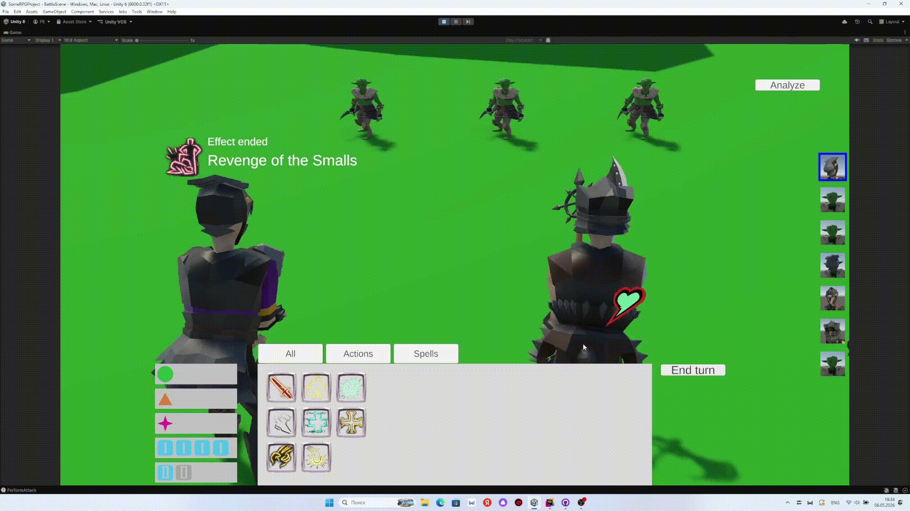

# JRPG D&D Prototype

Прототип пошаговой JRPG-боевки с идеей: взять линейные сражения в духе JRPG и добавить к ним ресурсы, броски, реакции и способности, вдохновленные D&D.

Состояние проекта: полноценного gameplay loop, кампании и мета-прогрессии пока нет, но базовая боевая сцена уже собрана. В ней можно проверить ход боя между союзниками и противниками, работу инициативы, действий, ресурсов, бросков, статусов, реакций и простого AI.

## Что Уже Есть

- Пошаговая очередь инициативы: юниты бросают инициативу, ходят по очереди, удаляются из очереди при смерти.
- Базовые ресурсы персонажа: действие, бонусное действие, реакция, а также классовые и размеченные ресурсы вроде ячеек заклинаний.
- Система действий и заклинаний: действие само проверяет ресурсы, выбирает цели, публикует события до/во время/после применения и списывает ресурсы после успешного использования.
- Реакции и пассивные эффекты через event bus: способности могут вмешиваться в чужие броски и действия, менять цель атаки, добавлять бонусы, отменять или модифицировать результат.
- Боевая математика: d20-броски, преимущество/помеха, критические попадания/промахи, спасброски, броски урона и лечения.
- Здоровье, броня и типы урона: поддержаны сопротивление, иммунитет и уязвимость к типам урона.
- Статус-эффекты: эффекты навешиваются на юнитов, активируются/деактивируются и могут сниматься на начале или конце хода.
- UI боя: панель действий, отображение ресурсов, выбор целей мышью, всплывающие окна реакций, трекер инициативы и окно анализа персонажа.
- Простое поведение противников: AI выбирает доступные непассивные действия случайно и завершает ход.
- Асинхронная загрузка контента через Addressables и UniTask.
- DI-инфраструктура на Zenject: глобальные сервисы, сервисы сцены боя и контейнеры отдельных боевых юнитов.  

Ниже показан пример вмешивания в порядок хода, когда персонаж1 атакует гоблина и промахивается, гоблин контратакует персонажа1, а персонаж2 реагирует и подставляется под удар.  

## Текущий Игровой Контент

- Сцены: Assets/Game/Scenes/BattleScene.unity и Assets/Game/Scenes/EmptyScene.unity.
- В BattleScene сейчас используется тестовый старт боя: BattleSceneInstaller спавнит 3 союзников, несколько базовых противников и одного противника-мага через заранее назначенные Addressable-ссылки.
- Боевые юниты: Cleric, Fighter1, Fighter2, BaseGoblin, WitchGoblin, а также базовые префабы юнитов.
- Действия: обычная атака, уклонение, Action Surge, Second Wind, защитный стиль, пассивы бойца, контратака и расовые/вражеские действия.
- Заклинания и эффекты: Guidance, Bless, Guiding Bolt, Healing Word, Holy Fire, Malicious Mockery, тестовое заклинание урона и связанные статус-эффекты.
- Данные боя вынесены в Assets/Game/Data: ресурсы, действия, заклинания, оружие, типы урона, анимационные данные и UI-данные.

## Как Запустить

1. Открыть проект в Unity 6000.0.32f1.
2. Дождаться импорта пакетов и Addressables.
3. Открыть сцену Assets/Game/Scenes/BattleScene.unity.
4. Нажать Play.

Важно: в ProjectSettings/EditorBuildSettings.asset сейчас подключена только Assets/Scenes/SampleScene.unity. Для сборки демо нужно добавить игровые сцены из Assets/Game/Scenes в Build Settings / Build Profiles.

## Технологии

- Unity 6000.0.32f1
- Universal Render Pipeline 17.0.3
- Addressables 2.2.2
- Input System 1.11.2
- Cinemachine 3.1.6
- TextMesh Pro / UGUI
- UniTask
- Zenject
- DOTween

В проект также импортированы внешние ассеты для персонажей, оружия, окружения и анимаций. Их документация лежит рядом с соответствующими asset-pack папками в Assets.

## Структура Проекта
- Assets/Game/Scripts/Battle - бой, очередь инициативы, действия, статусы, выбор целей, AI, камера, анимации боя и завершение боя.
- Assets/Game/Scripts/Characters - юниты, характеристики, ресурсы персонажей и модульные персонажи.
- Assets/Game/Scripts/Rolls - броски кубов, атаки, урон, лечение, спасброски и события вокруг бросков.
- Assets/Game/Scripts/Events - синхронная и асинхронная шина событий с фильтрацией и этапами обработки.
- Assets/Game/Scripts/UI - экран действий, трекер инициативы, выбор целей, выбор уровня ресурса и анализ персонажа.
- Assets/Game/Scripts/Contexts - Zenject-инсталлеры проекта, сцены боя и отдельного боевого юнита.
- Assets/Game/Data - настраиваемый контент: ресурсы, действия, заклинания, эффекты, оружие, типы урона и анимации.
- Assets/AddressableAssetsData - группы Addressables для данных, префабов и спрайтов.

## Архитектурная Идея

Главная точка расширения - события боя. Действия, броски, получение урона, лечение, начало и конец хода публикуют события, а реакции, пассивы и статусы подписываются на них и меняют ход выполнения. Поэтому новая способность чаще всего добавляется как префаб действия или статус-эффекта, который подписывается на нужное событие и вносит свою правку.

Для простых заклинаний есть SimpleSpellTemplate: через данные можно настроить цели, атаку или спасбросок, урон, лечение и навешивание статуса. Для более сложных способностей есть отдельные классы действий и эффектов.

## Известные Ограничения

- Нет полноценной кампании, исследования, инвентаря, сохранений, прогрессии и меню.
- Старт боя пока жестко задан в BattleSceneInstaller; нормальная система выбора энкаунтера/спавна еще не сделана.
- AI противников временный: выбирает случайное доступное активное действие.
- В Build Settings пока не подключены игровые сцены.
- Автотестов для игровых систем в Assets/Game пока нет.
- Часть данных и Addressables выглядит как рабочий прототип: перед сборкой стоит пройтись по группам Addressables и убрать устаревшие ссылки.
- Броня пока частично настроена через тестовое поле в Armor.